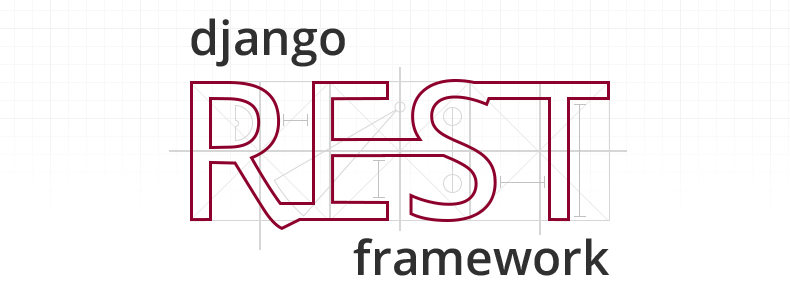
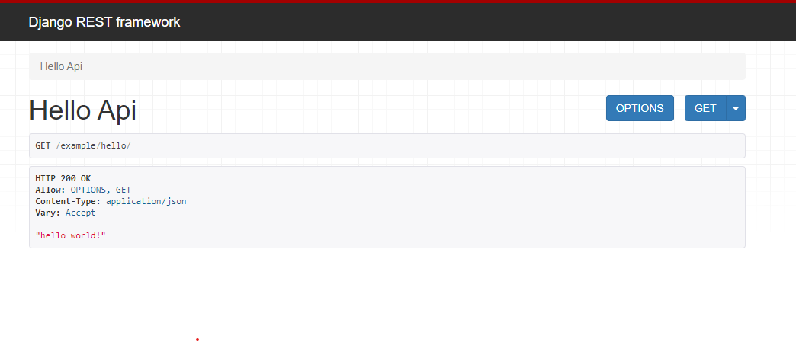

# Django rest Frame Work 를 시작하며




## DRF ?
<pre>
사실 Django만을 사용한다면, 웹 페이지만을 뽑아내는데는 문제 없을 것이다.
하지만 최근에는 web 은 front와 backend로 분리 되고 또 mobile app ( andorid, ios ) 를 사용한다. 이에 대응하기 위해서는 banckend 에서 api를 사용해 여러 디바이스에 data 를 뿌려줘야하는데, Django 보다는 Django rest Frame Work를 사용하면 훨씬 간편하게 작업 할 수 있다.

python 에서는 DRF 뿐만 아니라 flask, fastapi 등등이 있다
</pre>

## 시작하기 ( 사실 처음은 Django와 비슷하다. 왜 ? 어짜피 Django니깐 ) 이부분은 cmd or shell 에서 해야한다.
```
python -m venv myvenv # 개발환경 생성

source myenv/bin/activate # 개발환경 활성화

pip install django # Django 설치 버전을 설정 할 수 있다. pip install django==3.2.10

django-admin startproject backend . # Django 

pip install djangorestframework # DRF 설치, 이또한 버전 설정이 가능

# 일단 앱을 하나 만들자.
python manage.py startapp example
```

## 설정하기
    * python 개발환경과 django, drf 설치가 끝났다면 django의 핵심인 settings.py에서 app 을 등록하고 시간 설정까지 해야한다.
```python
# backedn/settings.py
INSTALLED_APPS = [
    "django.contrib.admin",
    "django.contrib.auth",
    "django.contrib.contenttypes",
    "django.contrib.sessions",
    "django.contrib.messages",
    "django.contrib.staticfiles",
    'rest_framework',
    'example',
]

TIME_ZONE = 'Asia/Seoul'
```

## 코딩을 해보자
    * DRF 는 django와 상당히 유사하다. 다른점은 template 을 사용하지 않고 models.py, views.py, serializers.py 를 사용한다는 점이다. 물론 다른 file을 추가해서 사용할 수 있지만 말이다.
```python
# example/views.py

from rest_framework.decorators import api_view

# 상당히 쉬운 코드이다. 하지만 이것도 api 이다.
# 해당 api는 http method의 GET만을 호출 했을 때 동작한다.
@api_view(['GET'])
def HelloApi(request):
    return Response("hello world!")
```
> @api_view(['GET']) <- 데이코레이터 이다.
> 말 그래돌 함수를 꾸민다고 한다. 좀 추성적이라 감이 안오는데
> 함수의 성격을 표시해주는 표기법이라 생각하면 조금 쉽다.
> but 데이코레이터는 python에서만 있는 개념이 아니니 공부가 필요하다.

```python
# 아래의 파일은 경로에 없다. 그래서 새로 생성해줘야한다.
#example/urls.py

from django.urls import path, include
from .views import HelloApi

urlpatterns = [
    path("hello/", HelloApi),
]
```

```python
#backend/urls.py
from django.contrib import admin
from django.urls import path, include

urlpatterns = [
    path("admin/", admin.site.urls),
    path("example/", include("example.urls"))
]


```

## 이제 'python manage.py runserver' 를 shell 에 입력하고 -> http://127.0.0.1:8000/example/hello/



<pre>짜잔 !!! 상당히 멋진 화면이 나온다. 드디어 api 가 동작하고 있는 것이다.

나도 열심히 적어 보겠다..........
</pre> 